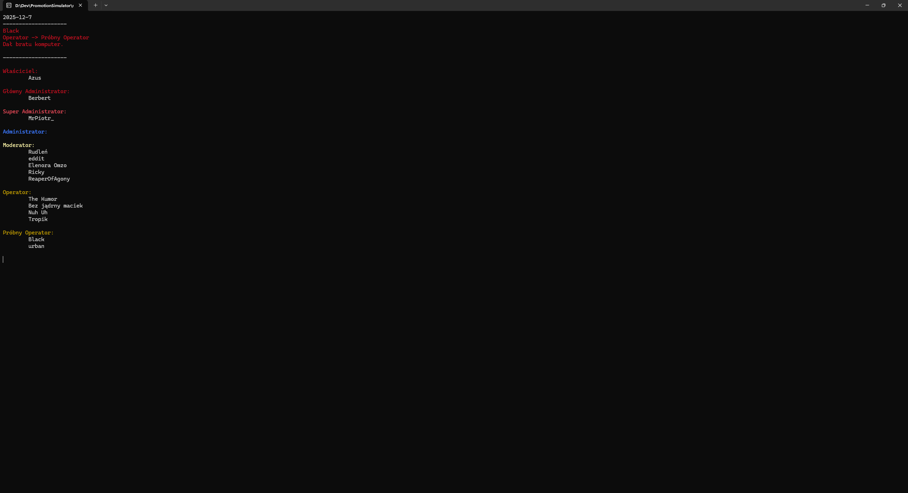

# PromotionSimulator
Simulation which shuffles it's "users" around.

## Description
This application simulates how people’s ranks could change overtime on a server. It uses simple
randomisation algorithm to reassign a randomly picked member’s rank. Member’s rank could either
go up by one or two, or go down by one or two. Users are categorised by ranks. Ranks have custom colours
assigned to them. Every time a member’s rank is affected, an information is displayed as to why. If it’s
a promotion, the information is displayed in green. If it’s a demotion, it’s displayed in red. Each “turn”
passes by 1 to 14 days, which can be changed in a config file. There’s no end to the simulation and it’s
not realistic, as anyone can become owner of the server.

